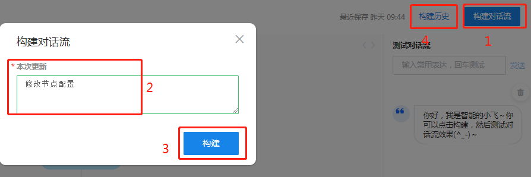
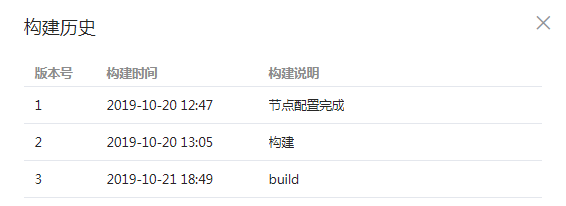
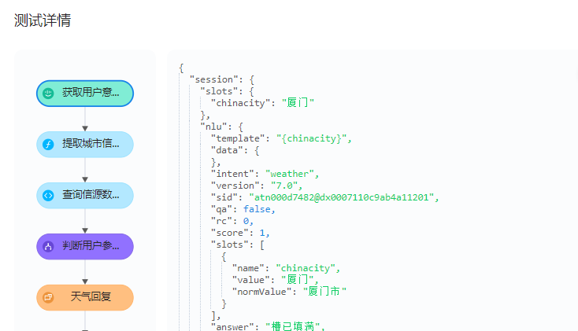
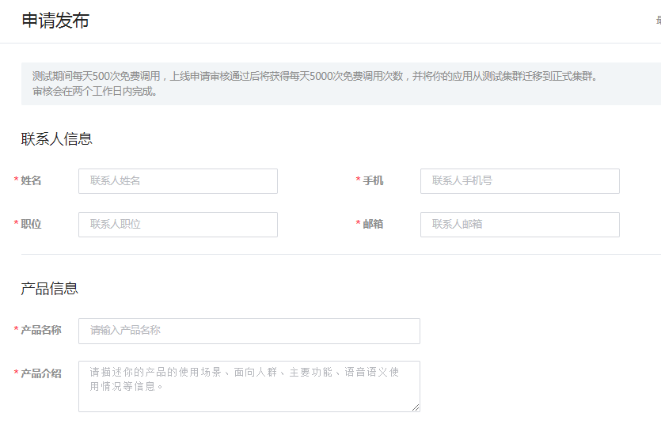
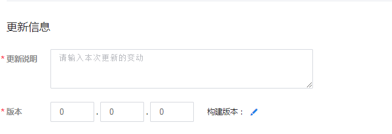
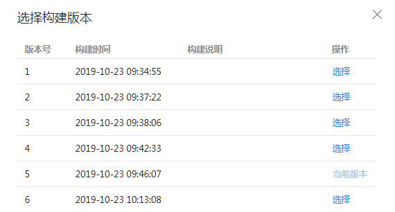

# 对话流构建与发布

## 构建测试

配置好的对话流，需要经过构建操作然后才能进行测试。构建操作如下图1-2-3步：

每次构建操作会对应一个构建版本，通过点击"构建历史"可以查看历史构建版本的信息：

构建通过的对话流，可以在“测试对话流”区域进行体验测试，如下图：

点击“查看JSON”可以进一步查看本轮对话过程在后台执行了哪些节点，以及经过每个节点后的session对象信息，有助于我们验证对话流的配置是否符合预期，如果出错或不合预期，也能方便通过测试详情分析原因并知道如何调整配置。

## 发布上线
测试通过的对话流，通过申请发布操作并由后台管理人员审核通过后方可发布上线。在申请发布页面，需要如实填写联系人信息和产品信息，以方便后台人员进行审核操作。

然后填写本次发布的更新说明和版本号，如下图：

点击“构建版本”，从已构建的版本中选择一个版本，申请发布。

