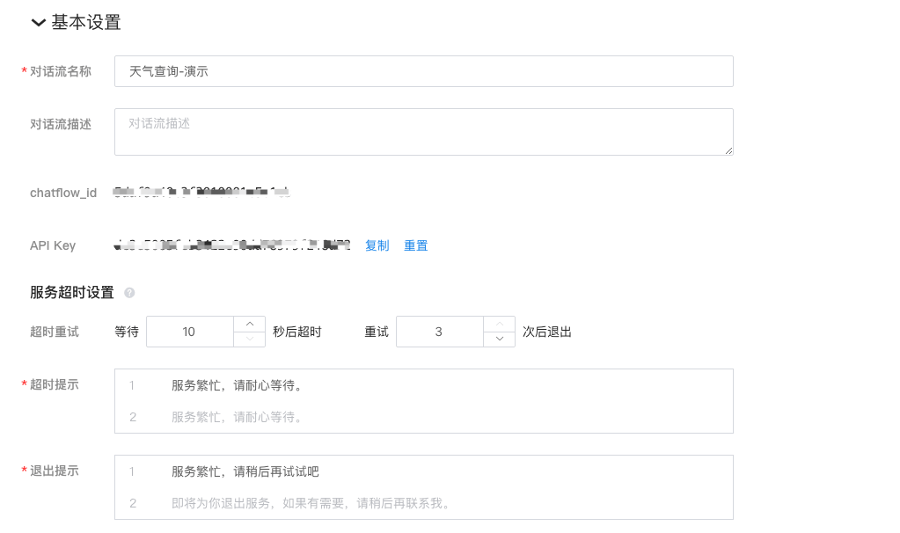
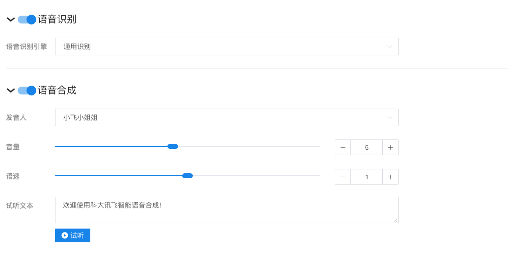
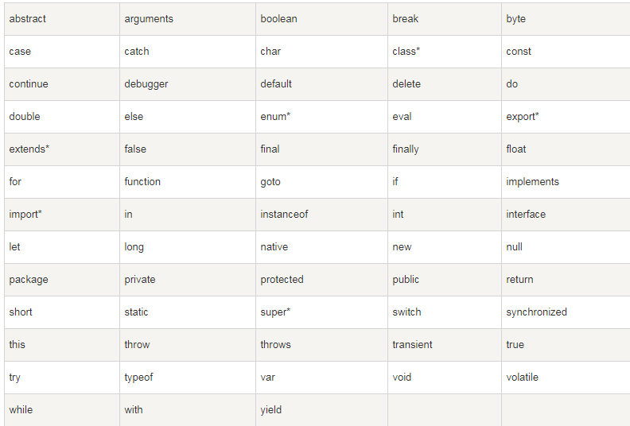

# 全局设置

[[toc]]

包括控制台、全局配置、意图和词典管理、回复管理、发布上线以及最核心的对话流设计模块。

## 控制台

显示用户（开发者）创建的对话流列表页面，编辑或创建新对话流的入口。

## 全局配置

配置对话流中通用的全局信息，包括对话流名称和服务超时等基本信息设置、语音识别和语音合成引擎相关配置，全局变量和公共函数的定义等。具体到对话流中的某个节点，可以在节点详情页面进行特殊配置。

### 基本设置

服务超时设置是为了友好的处理请求依赖服务超时，例如请求对话流中的识别服务或者意图理解服务超时等。开发者可以设置等待超时的时间，和允许重试的次数。其中，为了在超时以后给用户友好的提示，我们还允许开发者设置超时以后的提示语，并且在重试次数达到上限以后，回复退出提示，并结束整个对话流的执行。

::: warning 注意
对话流名称为必填，超时和退出提示的文本不进行校验
::: 

### 语音识别和语音合成引擎配置

语音识别允许用户设置对话流通用的识别引擎。语音合成配置允许开发者为对话流设置通用的发音人，系统提供了中众多的发音人可供选择，包括普通话，四川话和粤语等。同时，开发者还可以根据自己应用的特点，设置合理的语音合成音量和语速。另外，为了让开发者可以体验上述设置的效果，开发者可以输入一段文本，点击试听按钮，试听语音合成的效果。

::: warning 注意
试听文本内容不进行校验
::: 

### 定义全局变量

开发者可以通过全局变量设置在一些在对话流的多处脚本中都需要引用的变量，这样可以更加方便管理和维护。但是，开发者在设置变量名称，请保持对应脚本语言中变量的命名规则。

::: warning 注意
变量命名规则：
1. 由字母、数字、下划线和$符号组成；
2. 字母区分大小写；
3. 必须要求以字母、下划线和美元$符合开头；
4. 不能和以下JavaScript关键词同名。

::: 

### 公共函数

 开发者在全局函数中开发一些在多个节点的脚本中都可以使用的公共函数，例如时间处理函数和字符串的处理函数等。这样，开发者就可以在脚本中直接通过函数名使用这些公共函数。

