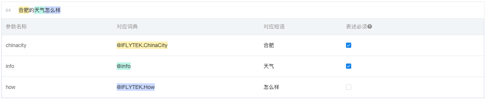

# 意图管理

[[toc]]

意图指用户在对话流中可能的请求或目的。如：作为餐厅的客服技能，用户可能要订位，排号，点餐，开发票等。


## 常用表达

用户在完成某一意图时，可能会有很多种表达方式， 以“根据单号查快递”这个意图为例，开发者应当尽可能完善用户所有的表达方式：

```
- 帮我查询顺丰快递88888888到哪里了
- 单号是88888888的快件到哪里了
- 顺丰单号88888888，这个快递到哪里了
- 我要查顺丰快递88888888的物流状态
- 我什么时候才可以收到单号88888888的顺丰快递
- 查一下88888888快递到哪里了
- 我要查顺丰快递
- 我要查快递
- 查一下快递
- ……
```

我们将这些表述统称为常用表达，一个技能中，每个意图下可能存在几十条到几千条不等的常用表达，为了保证技能语义理解的结果，我们建议开发者尽可能完善所有的常用表达。

### 例句常用表达
如果将上述纯文本直接填入控制台，我们称之为「例句常用表达」，添加后引擎会自动判断其中的槽位，如果存在错误，开发者可以进行手动更正。


### 模版常用表达

在如上的常用表达中，有两个关键**槽位**，`星座`和`时间`。我们称之为词典，词典在常用表达中用花括号`{` `}`代替。
```
* {time}{constellation}的幸运数字是什么
* {constellation}{time}的幸运数字是什么
```

以上将纯文本抽象过后的语句我们称之为「模版常用表达」

::: tip 模版模式的更多写法

为了方便开发者快速编写相似的常用表达，模版常用表达提供了可选符的写法。

常用表达中的花括号{}代表词典，中括号\[ \]代表可选符，小括号\( \)代表必选符。

- 花括号：打电话给{contact}
- 中括号：帮我呼叫张三\[的电话|的电话号码|的手机\]等同于：帮我呼叫张三、帮我呼叫张三的电话、帮我呼叫张三的电话号码、帮我呼叫张三的手机
- 小括号：帮我\(呼叫|拨打\)张三的电话号码 等同于：帮我呼叫张三的电话号码、帮我拨打张三的电话

**注意 ：一句常用表达中允许出现至多五个中括号和小括号。仅「模版常用表达」支持可选符写法**

::: 

两种常用表达自由使用，开发者可以根据使用习惯进行选择。

### 智能贴弧

为了减少你填写常用表达的工作量，我们上线了智能贴弧功能。在【例句常用表达】模式下，你输入熟料后，系统会自动判断其中的槽位，并匹配对应的词典。如果存在错误，你可以进行手动改正。

::: warning 注意
智能贴弧功能当前是测试功能，效果可能不够如意，你可以选择关闭智能贴弧功能。
:::

## 参数

###  定义参数  

参数是指用户常用表达中可能包含的参数。比如用户要查快递的时候，我们比较关心用户要查的是顺丰快递、圆通快递还是EMS，要查的单号是多少。

我们把常用表达中的参数抽象之后，会变成“我要查{顺丰快递/EMS/圆通快递}的{88888888}到哪里了”。抽象参数之后，我们需要对参数命名，以上常用表达会变为：

```
- 帮我查询{company}快递{number}到哪里了
- 单号是{number}的快件到哪里了
- {company}单号{number}，这个快递到哪里了
- 我要查{company}{number}的物流状态
- 我什么时候才可以收到单号{number}的{company}快递
- 查一下{number}快递到哪里了
- 我要查{company}
- 我要查快递
- 查一下快递
```

从上面的例子我们可以看出，一条常用表达中可以有多个槽或者没有槽。

除此之外，你也可以把用户表达中的部分词语进行抽象，比如可以定义 {iwant}=(帮我 | 我要 | 我想 | 给我)，这样可以降低书写常用表达的工作量。


### 参数对应词典


我们将快递公司名总结为**词典 {company}**，快递单号总结为**词典 {number}**。


在每个槽中，可能会出现多个取值

| company | number |
| :--- | :--- |
| 顺丰 | 88888888 |
| 圆通 | 12345678 |
| 韵达 | 1234567890 |
| EMS | 7777777 |
| 天天 | 9037646483 |
| …… | …… |

我们将这些取值的集合称之为词典。每个参数均需与词典进行绑定。在以上的例子中，我们将参数`{company}`与词典【expressCompany】绑定，将参数`{number}`与词典【IFLYTEK.number】绑定。

#### 开放词典

讯飞有一些开放的词典可以供开发者调用，比如针对快递单号参数 `{number} `，使用开放词典 【IFLYTEK.number】 可以很好的解决。

#### 自定义词典

但是快递公司的名称，需要开发者自己总结。你可以新建词典「快递公司/expressCompany」，为词典添加词条，建议「词条」填写归一化的词典名，「别名」填词条用户所有的可能表述方式。

在新建词典时，我们建议你确保为词典提供的值列表全面涵盖了用户的预期。有时用户可能说出的值你的技能不支持，但我们希望你依旧可以理解这个词。

例如：如果你制作一个查询国内城市天气的技能，但用户可能会说“帮我查一下洛杉矶的天气”。为了更好的用户体验，我们希望你的技能能够理解“洛杉矶”是一个城市。

更多词典相关的信息，请查看[词典](./dictionary.md)

### 参数追问

在配置意图的过程中，难免会遇到用户一次请求没有包含所有我们需要用到的信息的情况。为了方便开发者更加合理的设计多轮对话，对话流支持填槽对话的功能。

我们可以在控制台中设置参数是否必填。在实际的用户场景中，用户可能不会在一次交互中提供所有我们必须需要的信息。所以我们需要在后面的交互中向用户发起追问，让用户提供更多我们需要的信息，以完成后续的操作。

::: tip 举例
- 用户 ：我要查顺丰快递
- 讯飞 ：请你告诉我快递单号
- 用户 ：88888888
- 讯飞 ：你的顺丰快递正在进行派送
:::

在这个对话中，用户第一次交互时，缺少了我们查快递时必须的快递单号，此时需要系统进行追问。

这个操作，可以在控制台的参数引用区域，选择参数是否必填。若参数必填，你可以自定义追问语句，当系统发现用户的表述的信息里缺少必要的参数时，会进行主动的追问，开发者可以进行如下图的设置。

## 意图构建和测试

当你配置完成后，你需要将你的配置在讯飞引擎上构建生效。点击【构建按钮】，等待意图完成构建，即可对意图进行测试。

在意图配置右侧的测试框中，你可以尝试输入文本。
- 查看输入的文本是否可以命中意图。若没有命中，一般来说是常用表达未覆盖到这句输入。
- 若输入的文本中缺少必填参数，查看系统是否进行了正确的追问。
- 对系统的追问进行回答后，查看系统是否进行了正确的下一步处理。