# 对话流和节点

[[toc]]

如下图所示，对话流看似一个业务流程图，可以清晰描绘出人机交互的过程逻辑，相当于人机聊天过程思维的“可视化”，通常一个具体业务的对话流程设计和编排是由产品人员根据实际需求来完成。在对话流平台之外，他们需要借助于visio等一些画流程图的工具。

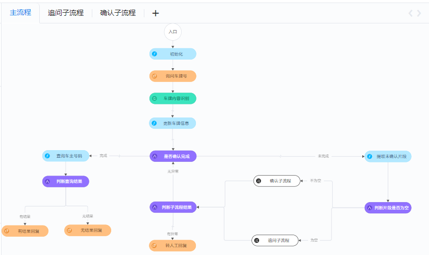

但其功能绝不仅限于此，因为组成对话流的每类节点都具有特定的功能，概括来讲分为三类：识别用户意图、处理用户需求、回复用户内容。通过对这些节点的合理组织和编排，构建成可执行流程并发布，就能快速实现一个人机对话系统。


以下分别介绍这些具有特定功能的节点。

## 节点介绍

节点是组成对话流的最小单元。上面提到每个节点都具有特定的功能，节点的功能由节点类型和属性配置来实现。每个类型的节点的属性都不尽相同，但所有的节点都具备以下公共属性：节点名称、类型和描述等，如下图：

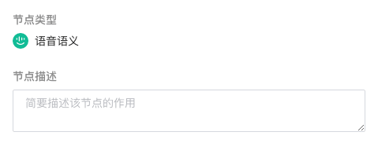

- 【节点名称】可以自定义该节点的名称，为了便于后期维护，推荐填写含义清晰的名称
- 【节点类型】显示节点类型为判断节点，不可修改
- 【节点描述】可以添加节点的描述信息，增加该节点功能的可读性

此外，每个节点还有各自与类型相关的属性，在配置对话流过程中常用的节点包括入口节点、语义理解节点、语音语义节点、判断节点、函数节点、http节点和回复节点。下面介绍每类节点在什么时候使用，并结合节点内部执行逻辑来说明如何配置节点。

### 入口节点

#### 节点介绍

入口节点是每个流程的开始节点。进入到对话流设计页面的画布区域，默认显示主流程的节点编排，也可以根据需要新增子流程。打开主流程或子流程，默认会显示一个“入口节点”，入口节点不可删除。

#### 内部执行逻辑

对于主流程，入口节点仅仅起标识作用，即标识主流程（也是整个对话流）的开始。

对于子流程，有两种进入方式：
1. 由主流程或其他子流程通过连线进入，采用连线进入时，相当于无条件进入，只要流程走到这个节点，就可以进入子流程。
2. 在语义节点打开了“跳转至其他子流程”开关时跳转进入。用户操作需要满足特定的条件才可进入，这个进入条件在子流程的入口节点设置。
   

入口节点内部执行过程如下所示：

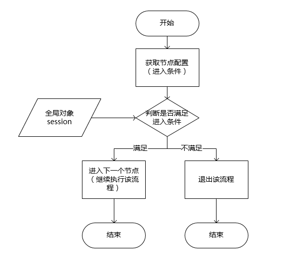


#### 如何配置

根据内部执行逻辑，入口节点需要配置是否有条件进入，如果有条件进入，还需要配置进入条件。配置界面如下图：

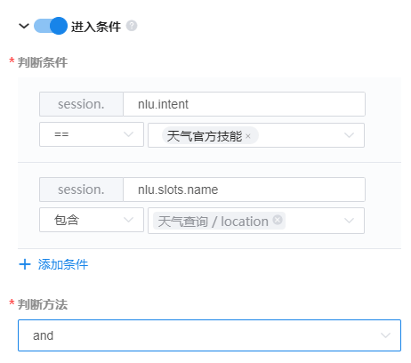

【进入条件】开关按钮，关闭则表示无条件进入该流程；打开则表示有条件进入，并需要配置进入条件

【判断条件】支持可以添加多个判断条件，每个判断条件由三部分组成：参数名、条件类型和值。

【参数名】参数名为session对象里的字段名，可以通过下拉列表选择session内置的字段，用户也可以手动输入自定义的参数。内置的字段说明如下：

| 字段名                 | 含义         |
| ---------------------- | ------------ |
| `session.nlu.intent`     | 意图名       |
| `session.slots.name` | 参数名     |
| `session.slots.value` | 参数值     |
| `session.nlu.answer`     | 意图回复文本 |
| `query.text`             | 用户查询文本 |

【条件类型】支持==、!=、包含、正则匹配四种条件类型

【判断方式】and、or两种类型，如果为and，多个条件同时满足才会进入流程。如果为or，满足其中一个条件即可进入。


### 语义理解节点

#### 节点介绍

语义理解节点的功能是：接收来自用户的文本输入请求，进行语义理解得到用户意图。

#### 使用场景

如果设计的对话流用于和用户进行文本交互的场景，或者是客户端已经进行了语音识别处理，则可以将等待用户输入的节点配置为语义理解节点。

语义理解的结果更新到session.nlu字段进行存储。

#### 内部执行逻辑

语义理解节点内部执行过程如下所示：


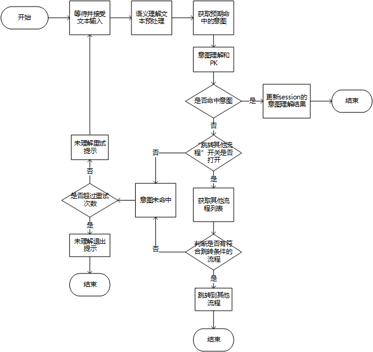


#### 如何配置

根据内部执行逻辑，语义理解节点需要配置语义理解文本预处理、预期命中意图、跳转其他子流程以及意图未命中时的重试次数、重试提示和退出提示语等内容。配置界面如下图：

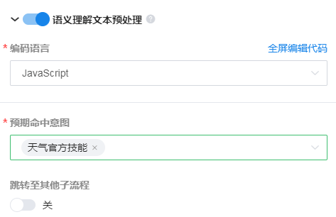


【语义理解文本预处理】开关按钮，如果打开，可以编写脚本对需要进行语义理解的文本进行预处理。

【预期命中意图】在每个节点只需根据当前的节点状态进行有限意图的语义理解，这里可以选择在该节点期望理解的意图，可供选择的意图列表为在意图管理模块中配置的，这里直接引用。

【跳转至其他子流程】如果按照预先设定的对话流程执行下去，那么用户的输入在语义理解节点一般都能够理解为"预期命中的意图"。但有的时候用户还有可能“转移话题”。

::: tip 举例
我们的对话流总共定义了三个流程：订餐、排号和问天气。现在用户在订餐流程的某个节点可能会忽然问一句“明天的天气怎么样”。这时仅在当前的语义理解节点就无法理解出用户的真实意图，对话流也就不能继续执行下去。

而如果打开“跳转至其他子流程”开关，当用户的输入不能正确理解为当前节点配置的意图时，系统还会继续判断是否为其他子流程的入口意图，如果是，则会直接跳转到其它子流程继续执行。在这个例子中，就会继续跳转到天气子流程继续执行。
:::

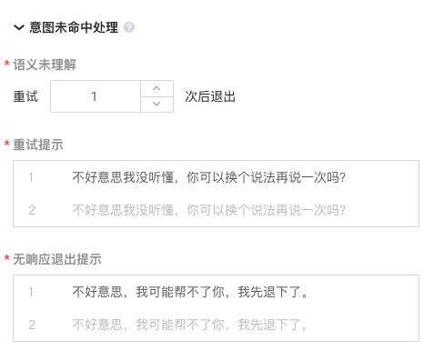

【意图未命中处理】如果用户的输入没有被系统理解，不能命中预期的意图或者其他子流程的入口意图，系统可以表示没听懂用户所说并提示用户再说一遍。开发者可以选择配置语义未理解时【重试的次数】和【重试时的友好提示】。

【无响应退出提示】如果经过几次重试以后语义理解仍然无结果，或用户未输入任何信息，系统会返回未理解退出提示，结束整个对话流。

::: tip 建议
为了提供良好的用户体验，我们建议：
1. 提示的次数不超过3次。
2. 配置多条提示语。在实际交互的过程中，系统会随机返回一条提示语。
:::


### 语音语义节点

#### 节点介绍

语音语义节点的功能为接收来自用户输入的语音请求，通过语音识别转化为文本，然后进行语义理解得到用户的意图。

#### 使用场景

如果设计的对话流用于和用户进行语音交互的场景，则将需要等待用户输入的节点配置为语音语义节点。

需要说明的是，语音语义节点同时也支持用户的文本输入，当系统判断请求消息为文本类型时会跳过语音识别直接进行语义理解。因此，对于针对既有语音交互又有文本交互的场景（类似于微信聊天，既支持文字输入又支持语音输入），直接配置语音语义节点即可。

语音语义节点的输出结果，即语音识别得到的文本以及语义理解的结果，更新到session.nlu字段进行存储。

#### 内部执行逻辑


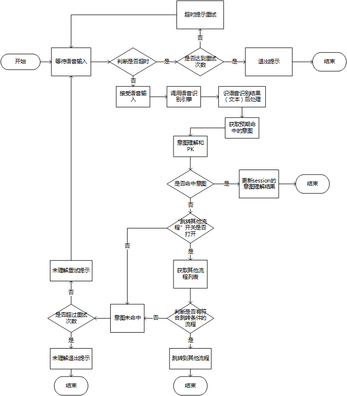


#### 如何配置

语音语义节点实际上可以看成是语音识别和语义理解的组合，因为在实际人机语音交互的场景中，当识别到用户语音输入以后都一般要进行语义理解，为了简化对话流的编排，便设计了语音语义这样一个组合节点。

理解到这一点，便不难理解上面的内部执行逻辑。关于语音语义节点的配置，也基本和语义理解节点相似，只是增加了“语音识别引擎”和“识别后处理”的配置，如下图：

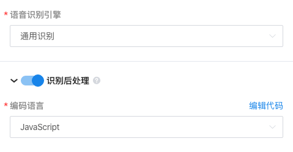

【语音识别引擎】接收语音输入时调用的语音识别引擎，如果没有配置，则默认使用全局配置里配置的对话流通用识别引擎。

【识别后处理】开关按钮，如果打开，可以编写脚本对语音识别的结果进行后处理，如过滤掉一些语气词、纠正常见易识别错的词语，以提高进行下一步语义理解的结果。

其它的配置和语义理解节点一致，这里不再赘述。


### 判断节点

#### 节点介绍

判断节点承担处理判断并分发执行的功能。

#### 使用场景

如果用户需要根据某个条件进入不同的分支，去执行不同的交互操作，此时可以选择使用判断节点。例如，在酒店预订业务中，需要根据的预定的时间进行判断，大于三个月的转人工，三个月之内的进行正常流程，过去时间提示重新输入等。

#### 内部执行逻辑

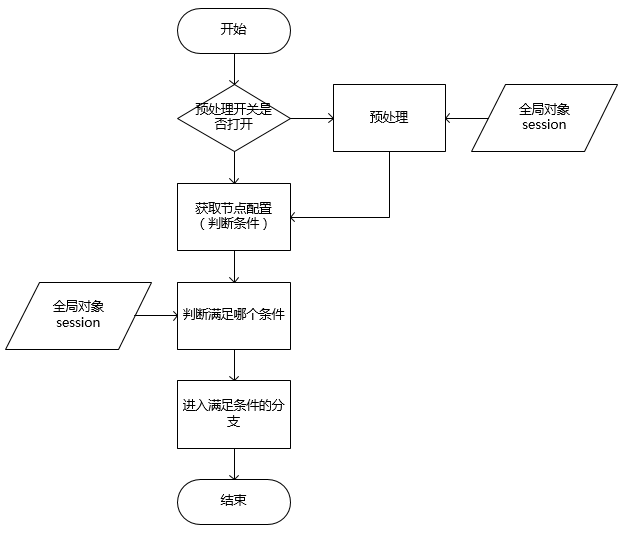


#### 如何配置

根据内部执行逻辑，判断节点的配置包括编写预处理脚本和设置判断条件，配置界面如下图：

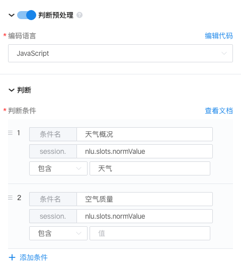

【判断预处理】开关按钮，打开该按钮以后，用户可以在判断之间使用脚本代码块对全局上下文（session）中的信息进行一些处理。

【判断条件】用户可以点击添加条件按钮，添加一个判断分支，一个判断分支包含以下四个部分：

- 条件名：用户可以给这个分支起一个易理解辨识的名字，这个条件名会显示在判断节点对应的分支连线上。
- 参数名：参数名和开始节点中的参与名使用方式相同，可以通过下拉列表选择session内置的字段，用户也可以手动输入自定义的参数
- 判断方式：目前系统内置如下多种判断方式
  - 等于（==）：可以用于字符串和数值类型的等于比较
  - 不等于（！=）：可以用于字符串类型和数值类型的不等于比较
  - 大于（>）,小于（<）,大于等于（>=）,小于等于（<=）:用于数字类型的字段比较
  - 为空/不为空：用于判断字符串或者对象是否为空
  - 包含：判断字符串是否包含子串，还可以判断数组是否包含某个元素
  - true和false：用于boolean类型值的判断
  - 正则表达式：用于判断值是否和正则表达式匹配
  - 其它：在上述任何条件都不满足的情况下，可以用该条件，无条件进入该分支
- 值：用于进行判断的依据


### http请求节点

#### 节点介绍

http节点用于请求http服务。

#### 使用场景

如果用户需要使用http方式请求第三方API接口，可以使用该节点。

#### 内部执行逻辑


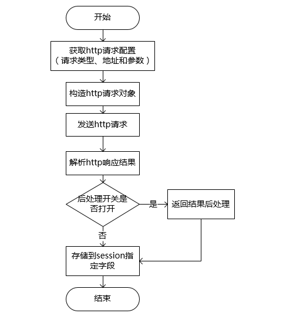

【 如何配置】

http节点配置界面如下所示：

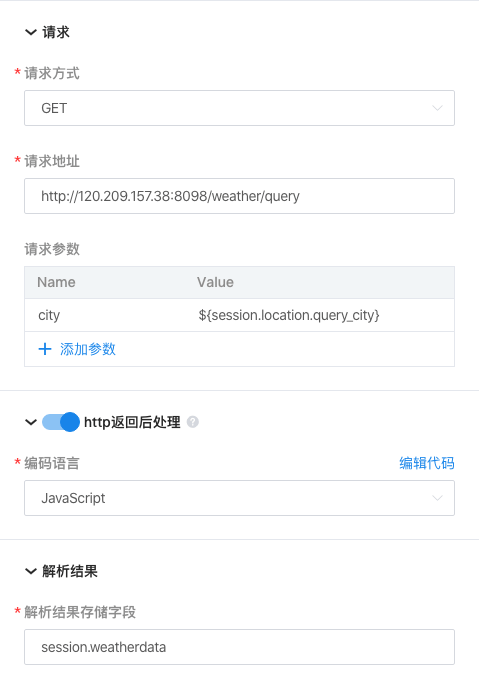


【请求方式】http请求的请求方式，目前支持GET和POST两种请求方式

【请求地址】<font color=red>***请求地址须为有效地url地址，我们将进行URL格式校验***</font>

【请求参数】用户可点击添加参数按钮，为http请求添加一个请求参数，这里的请求参数值可以是一个固定的常量，例如city=合肥，也可以引用全局上下文（session）中的值，例如下面的这种格式。

```
city={session.location.city}
```

【http返回后处理】主要是对http的请求结果做些处理，http的请求结果会放在http对象参数中，开发者可以在脚本代码块中引用这个对象，做预处理。例如，某个天气的API接口的返回数据格式如下：

``` json
{
  "airData": 62,
  "airQuality": "良",
  "city": "合肥市",
  "date": "2019-05-08",
  "dateLong": 1557244800,
  "date_for_voice": "今天",
  "humidity": "67%",
  "img": "http://aiui-res.ufile.ucloud.com.cn/weather/01.png",
  "lastUpdateTime": "2019-05-08 08:00:08",
  "pm25": "39",
  "temp": 15,
  "tempHigh": "23℃",
  "tempLow": "13℃",
  "warning": "",
  "weather": "多云",
  "weatherDescription": "温度适宜，气温和昨天差不多。",
  "weatherDescription3": "13℃到29℃，风不大，气候温暖。",
  "weatherDescription7": "13℃到30℃，风不大，气候温暖。",
  "weatherType": 1,
  "week": "周三",
  "wind": "东北风微风",
  "windLevel": 0
}
```

开发者可能只需要知道今天气温的一个范围，不需要其他的一些字段，则可以编写下列脚本代码块做处理即可：

```javascript
newHttpResult = {}
tempRange = http.tempLow + '~' + http.tempHigh
newHttpResult.tempRange = tempRange
http = newHttpResult
```

【sessionField】`sessionField`字段是指，开发者可以将http请求的结果保存在全局上下文（session）对象的某个属性下，供后续对话使用。

::: tip 举例
我们可以将上述脚本处理后的请求结果保存在session.weather中。
:::

### 云函数节点

#### 节点介绍

云函数节点可以在线编写代码函数，部署在讯飞的服务上，进行相应的业务执行。

#### 使用场景

如果用户需要实现的业务逻辑，对话流还不能支持，用户可以通过云函数节点编写相应的脚本，来实现相应的业务逻辑。例如提取意图理解结果中的槽位、处理http的请求结果等操作。

#### 内部执行逻辑

云函数所有的操作都是基于全局上下文（session）的，也就是说，云函数的入参就是session，所有的处理结果也需要添加到session中，才可以生效。具体逻辑如下所示：       

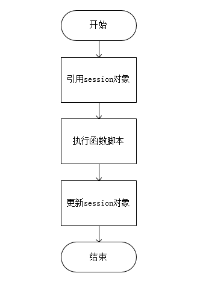


#### 如何配置

云函数节点配置界面如下所示：

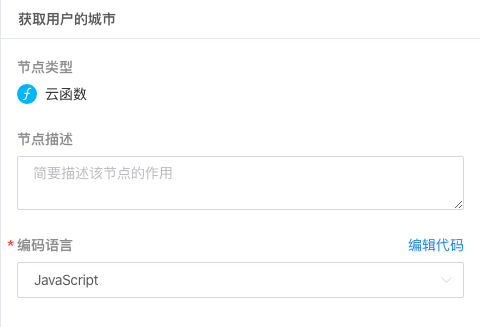

配置说明:

用户在选择了脚本语言以后，可以点击全屏编辑代码进入在线代码编辑器，开发处理脚本。

::: tip 举例
在一个预定酒店的业务中，用户可以通过目前的意图理解的时间slot，判断预定时间是否大于三个月，或者是否是过去时间，其中，全局上下文结构如下所示：

  ```json
  {
    "nlu": {
      "intent": "date",
      "slots": [
        {
          "name": "date",
          "end": 3,
          "begin": 0,
          "value": "5月7号",
          "normValue": "{"datetime":"2019-05-07","suggestDatetime":"2019-05-07"}"
        }
      ],
      
    },
    "payload": {
      "telephone": "111111111"
    }
  }
  ```

开发的几个简单的处理脚本代码块如下

  ```javascript
  session.time = {};
  for(var i=0;i<session.nlu.slots.length;i++){
    if(session.nlu.slots[i].name == "date"){
      var normValue = session.nlu.slots[i].normValue;
      var normValueObj = JSON.parse(normValue);
      session.time.suggestTime = normValueObj.suggestDatetime;break;
    }
  }
  var today = new Date();
  var threeMonth = new Date();
  threeMonth.setMonth(threeMonth.getMonth() + 3);
  var todayStr = today.toISOString().slice(0, 10);
  var threeMonthStr = threeMonth.toISOString().slice(0, 10);
  if(session.time.suggestTime < todayStr){
    session.time.type = "old";
  }else if(session.time.suggestTime > threeMonthStr){
    session.time.type = "future";
  }else{
    session.time.type = "rightTime";
  }
  ```

经过该代码块处理以后，全局上下文（session）的结构变成了下面这样

```json
{
  "nlu": {
    "intent": "date",
    "slots": [
      {
        "name": "date",
        "end": 3,
        "begin": 0,
        "value": "5月7号",
        "normValue": "{"datetime":"2019-05-07","suggestDatetime":"2019-05-07"}"
      }
    ],
    
  },
  "payload": {
    "telephone": "111111111"
  },
  "time":{
      "suggestTime":"2019-05-07",
      "type":"rightTime"
  }
}
```
:::


### 回复节点

#### 节点介绍

在接收用户的输入进行意图理解，并针对理解结果进行业务层面的处理以后，需要将处理的结果“回复”给用户，这样才完成一轮人机对话。因此，我们在配置对话流的过程中，如果判断在某个节点需要“回复”用户一些内容（包括文本、音频甚至h5页面等），则需要配置一个回复节点。

#### 使用场景

如果在业务流程中，如果需要告知用户什么信息，或引导用户的后续交互，可以使用回复节点。

#### 内部执行逻辑

回复节点在执行的过程中，首先会随机选择配置的多条回复语模板中的一条。然后，如果回复语中有引用session中内容，或者音频，会进行替换，生成最终的回复语。最后，会判断回复语的类型，如果是文本类型，则直接返回，如果是语音回复，则需要获取合成的配置参数，调用合成服务，将合成后的音频返回给用户，具体执行过程如下图：

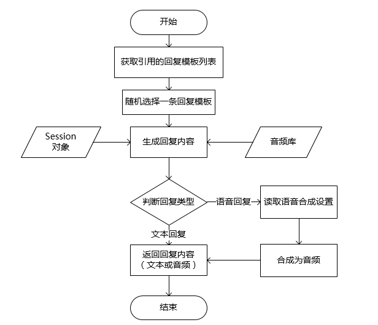


#### 如何配置

回复节点的配置详情如下图：

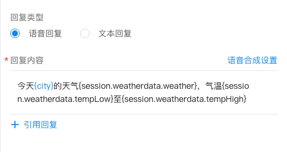

【**回复类型**】

回复节点支持配置语音和文本两种回复类型，需要结合实际的对话场景来选择。

如果选择语音回复，涉及到语音合成设置，包括选择发音人、调节音量和语速等，配置页面如下图：

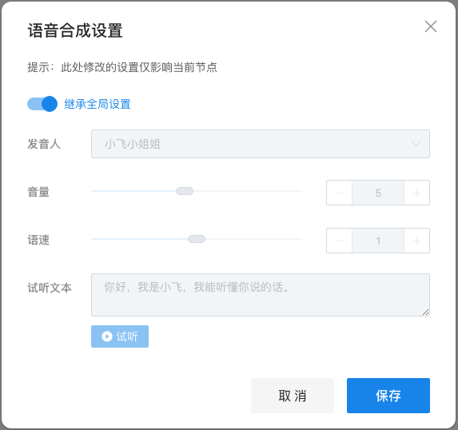


这里的设置仅仅是针对当前回复节点的个性化语音合成参数设置。如果不需要针对当前节点定制，则选择“继承全局设置”，就会根据全局设置中配置的对话流全局语音合成参数来合成。

【**回复内容**】

系统在当前节点回复给用户的内容，一般为引用"回复管理"模块配置好的回复模板，如下图：

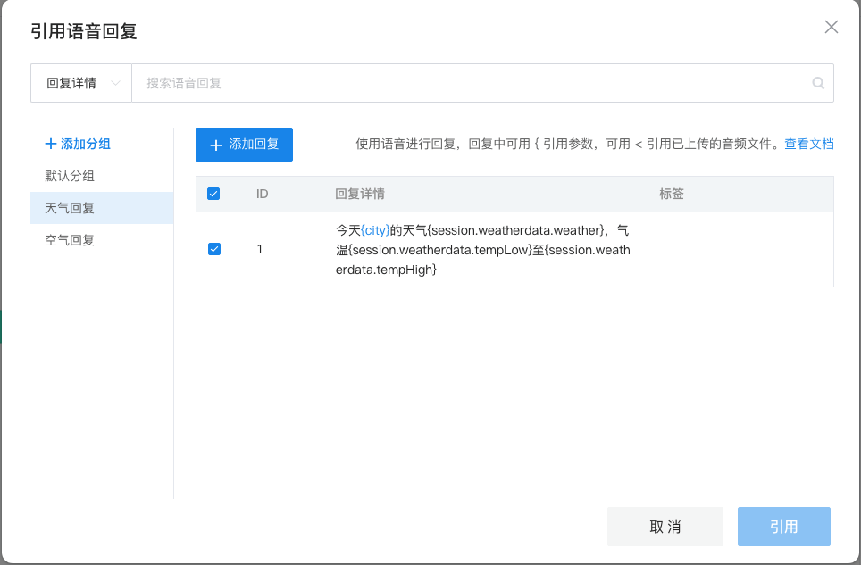


模板里可以包含上下文变量，在实际交互过程中会进行替换。对于语音回复类型，模板里也可以引用提前录制好的音频。

另外，在每个回复节点可以添加多条回复，实际交互过程中系统会随机选择一条“回复”用户，体现人机对话内容的多样性、灵活性。


## 节点连接

以上介绍了组成对话流常用的节点，每个节点何时使用，内部执行逻辑是怎么样的，如何配置节点属性等。通过对这些节点的合理组合，我们就可以像使用visio画流程图一样来编排对话流了。

由于组成对话流的每个节点具有特定功能，我们在编排对话流的节点时便不能任意组合这些节点，而是需要遵循一些基本的约束条件。

#### 入口节点

主流程的入口节点：

- 对于用户主动请求交互的场景，需要连接输入节点（语义理解、语音语义）用于接收用户的输入；
- 对于由机器引导用户交互的场景（如电话回访），需要连接回复节点；
- 如果需要初始化全局对象，则在主流程入口节点后连接函数节点。

子流程的入口节点，需要结合上一个流程的节点来判断。

#### 输入节点

语义理解和语音语义节点：

- 一般需要连处理类型的节点（http请求、判断、云函数），也可直接连回复节点；
- 不可以再连输入节点。

#### 处理类型的节点

- 可以继续连处理类型的节点（判断节点、http请求节点、云函数节点），也可以连回复节点；
- 不可以连输入节点（语义理解、语音识别）

#### 回复节点

- 如果还需要继续继续下一轮交互，则连接输入节点（语义理解、语音语义）。

#### 子流程节点

- 子流程节点通常连在判断节点后面，用于将复杂的对话流分解为多个子流程；
- 子流程后面可以连接什么节点，需要根据所关联子流程的结束节点类型来判断。