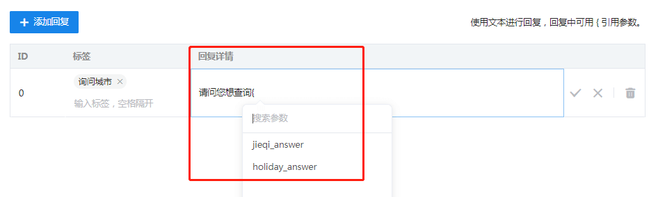
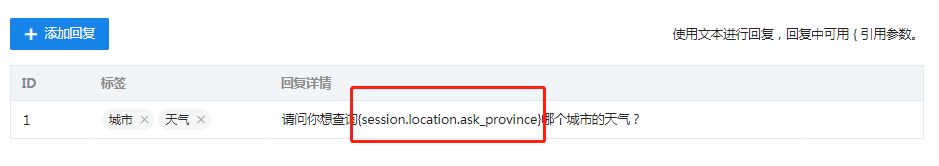
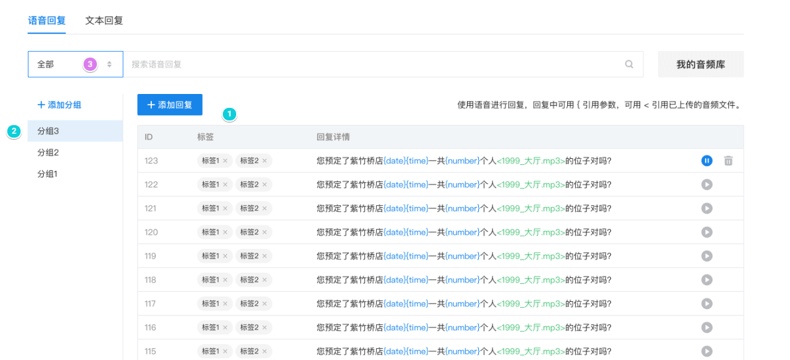
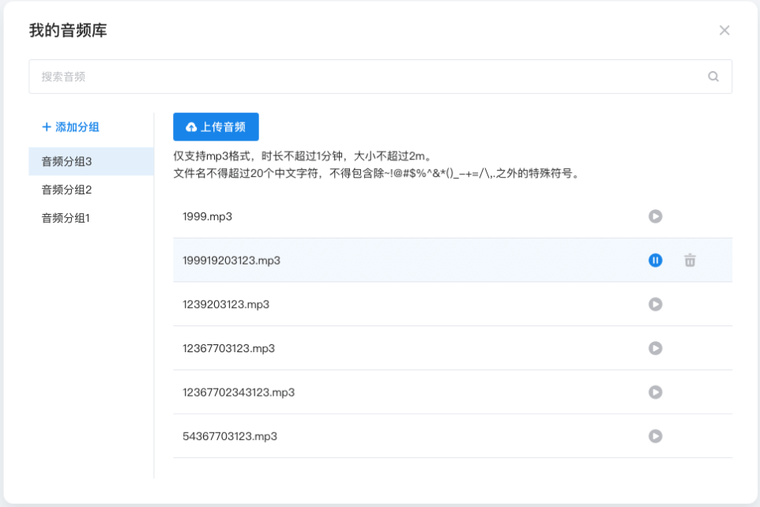
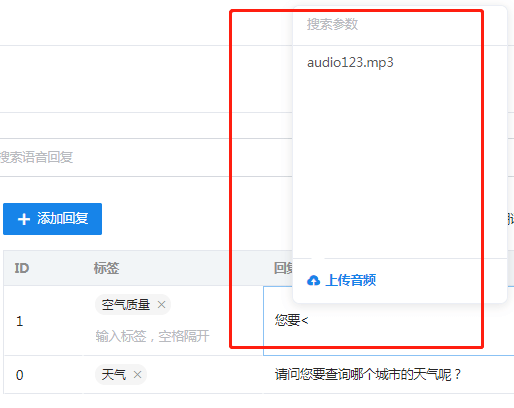

# 回复管理

[[toc]]

对话流中回复节点的回复语管理，支持语音和文本类型。两种类型的回复话术配置过程基本类似，唯一的区别在于语音回复支持引用音频。

### 文本回复

使用文本进行回复，回复中可用 { 引用参数。当在回复详情输入框里输入左花括号（"{"）时会出现弹出框，显示可选择引用的参数列表，这里的参数列表为全局设置里定义的全局变量，如下图：

​	

​	除了选择弹出框提示的参数，也可以手动输入session对象里定义的任何一个字段，如下图：

### 语音回复

用户可以上传音频到自己的音频库，在配置语音回复话术时，方便进行引用，如下图：

::: warning 注意
用户上传的音频文件，大小不超过10M
:::

使用语音进行回复，除了可用 { 引用参数，还可用 < 引用已上传的音频文件。

当在回复详情输入框里输入左尖括号（"<"）时会出现弹出框，显示可选择引用的音频列表，如下图：

