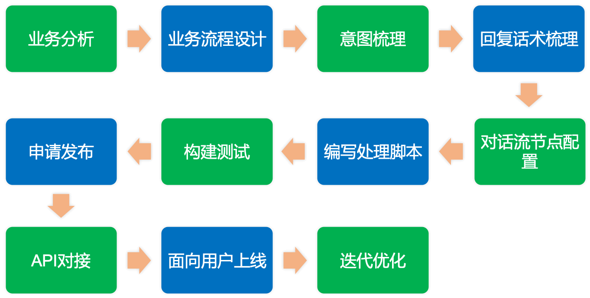
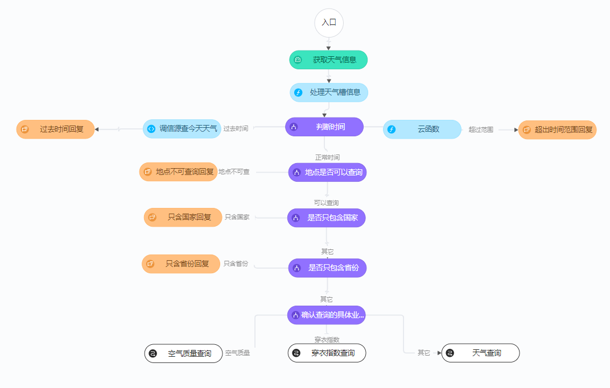
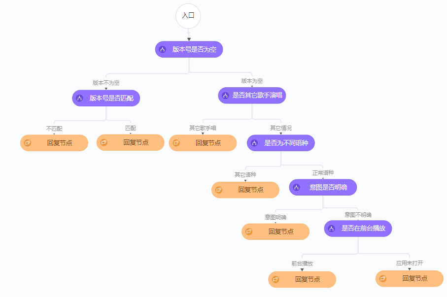
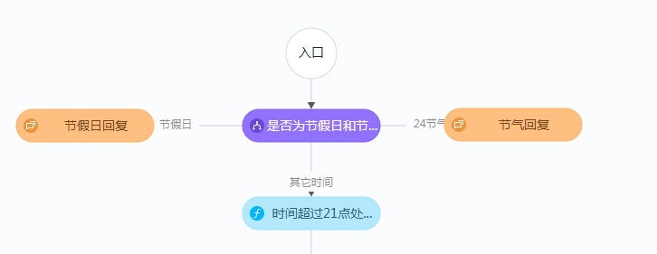
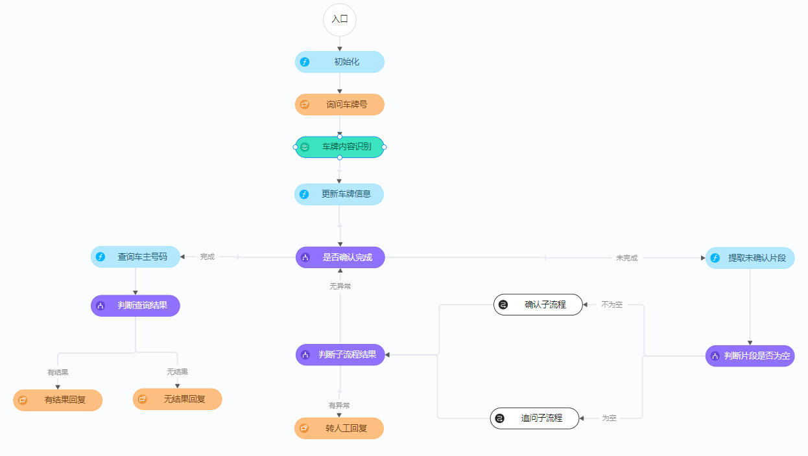
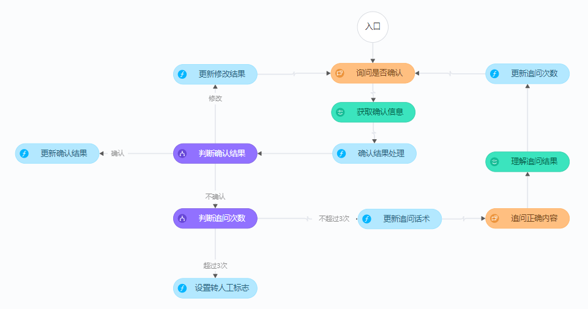

# 对话流设计最佳实践

[[toc]]

## 设计过程

使用iFLYOS 对话流平台设计对话流，大体上遵循以下步骤：

1. **业务分析**：产品人员分析业务场景，抽象业务流程，可根据需要画出业务流程图。
2. **搭建对话流框架**：创建对话流，并在对话流编排页面将业务流程转化成由不同类型节点组成的对话流程。
3. **意图配置**：根据对话流中的语义节点梳理出需要创建哪些意图，然后在意图管理页面上配置意图、构建测试。
4. **回复话术配置**：根据对话流中的回复节点梳理出所需的回复话术，然后在回复管理页面上配置回复话术模板。
5. **对话流节点配置**，包括：
   - 语义节点"预期命中意图"配置
   - 回复节点引用回复
   - 节点的其他配置信息完善，需要编写脚本的地方除外
6. **编写处理脚本**：开发人员熟悉产品需求，编写处理脚本，包括：
   - 定义全局变量
   - 编写公共函数
   - 对话流中的函数节点以及其它需要预处理或后处理的节点
7. **构建测试**：构建对话流并测试体验。
8. **申请发布**：测试通过的对话流，选择构建版本发布上线。
9. **API对接**：开发人员通过API接口将对话流服务与自有业务进行对接。
10. **面向用户上线→迭代优化**：获得真实用户数据，优化对话流。

## 设计规范参考

如何设计和编排一个好的对话流呢，需要关注两方面：一是要可读性，二是对话流执行的性能。

### 	提前设计

遵从上面的设计步骤，通过对话流平台编排对话流之前，建议首先应当进行业务需求分析，对于复杂的业务，可以先借助流程图工具来分析出业务流程，然后转化成对话流。针对比较熟悉的业务场景，可以省去业务流程图的环节，但负责对话流设计的人员在心里应该已经很清楚设计的思路和框架。

其次，建议先搭建出对话流的框架，暂时忽略节点的配置等工作。类比程序开发工作：良好的编程习惯一定是先搭建出代码框架，规划好项目结构，而不是一上来就写代码，想一步写一步、写一步想一步。等确定好对话流的框架以后，再结合流程中的语义节点和回复节点去归纳出需要哪些意图和回复，并在意图和回复管理页面进行创建、配置。最后再回过头来完善节点配置信息。

### 	合理选择输入节点

输入节点的功能为接收来自用户的文本或语音请求，经过语音识别以及语义理解，得到用户的意图结果。这里分三种情形来说明如何选择输入节点。

- 仅支持文本输入：选择语义理解节点
- 仅支持语音输入：选择语音语义节点
- 同时支持文本和语音输入：选择语音语义节点

从对话流的可读性和性能角度考虑，以上为最佳配置选择。

例如对于支持语音输入的情形，虽然我们还可以选择语音识别和语义理解节点组合的配置方式，但是针对复杂的业务场景，需要考虑的对话轮数比较多，这种配置方式将会使得对话流配置起来变得复杂（节点数增加、影响排版和可读性）。

### 	合理使用判断节点

人机交互过程中经常需要针对用户不同的问题意图进行不同的处理和回复，反映到对话流设计上就会出现多个和多级分支。分支的出现在一定程度上增加了对话流的复杂性。不过如果我们能设计出良好的分支流程，将有助于提高对话流的可读性。这里给出两点建议：

- **在对话流的开始通过判断节点针对一些特殊情况（可以直接进行回复）进行处理。**

例如下图为天气查询对话流，用户询问天气的意图细分为天气预报、空气质量和穿衣指数等子意图。我们需要先判断一些特殊情况，如地点是否可查询、只包含国家或省份等信息。针对这些情况直接给予对应的回复。排除掉这些特殊情形之后，再根据子意图（天气预报、空气质量、穿衣指数）分别进入对应的子流程。

如果不先针对一些特殊情况进行处理，而是一开始就根据子意图拉取子流程分支，进入到各个子流程里还是会涉及到这些判断处理，将会使得子流程变得复杂。

- **对于判断条件较复杂的情形，设计成多级分支**

  例如下面的多级分支流程，能够很清晰地找到每一种情形对应什么回复内容。相反我们如果设计出一个判断节点拉出7个分支的流程，虽然也能实现功能，但可读性会变得很差。

### 	合理使用云函数节点

通过云函数节点，开发者可以编写JavaScript脚本很方便地处理对话流中的部分业务逻辑。针对开发者设计和编写处理脚本的一些建议：

- 尽可能减少云函数节点的个数，将需要编写的处理脚本合并到尽可能少的云函数节点中。

- 对于上面多级分支的情形，如果每一级分支的判断节点都需要进行预处理，也建议在第一个判断节点之前通过云函数节点提前一次性处理完成。
- 建议将较复杂的处理逻辑写成公共函数，在云函数节点或者其他节点的预处理脚本里只需要引用相关的函数即可，这样可以避免云函数节点配置的频繁修改，迭代优化更方便。

### 合理设计回复节点

合理的设计和定义回复话术模板，也可以简化对话流的编排。

例如在天气查询的对话流里，需要针对节假日和24节气返回个性化的回复内容：在回复具体天气结果之前增加一句节日问候、节气提醒。

针对这个需求，一个最直接的实现方案是为每个特殊日期配置一个回复模板，并针对每个节气和节假日都配置一个回复节点，然后引用对应的回复。这将会带来几个问题：

​	（1）需要配置几十个回复模板和回复节点，工作量可想而知。

​	（2）这么多个节点，想要进行清晰的布局排版也是个问题。

​	（3）维护起来很麻烦，如果后续需要修改回复模板，需要一个个地去修改。

因此这肯定不是最好的解决方案。而如果我们能充分利用回复模板的设计思想和特性，将不同节日节气的个性化提示语定义成全局变量，并在回复模板里增加前缀参数去引用。这样一来最多只需要配置两个回复模板和回复节点即可，如下图：

### 	合理拆分子流程

对于复杂的业务场景，通过合理拆分出子流程来使主流程变得更清晰、可读。

例如下面的电话挪车对话流设计，对话流完成的主要功能是通过准确收集用户提供的车牌号码帮助用户查询对方车主的电话号码。在收集车牌号信息的过程中需要确保车牌完整和准确，因此可能需要多次追问和确认每一位车牌号码。

通过将追问和确认的过程设计为子流程，主流程变得清晰易读。反之如果将所有的节点都编排在一个大的流程里，不难想象，主流程布局将会很乱，大大降低对话流可读性。

追问子流程：

确认子流程：

